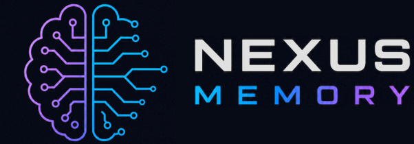
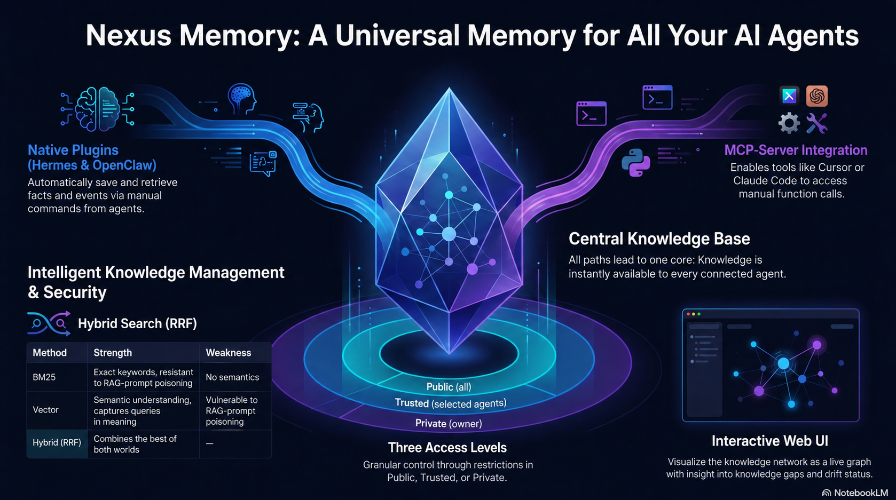

<p align="center">
 
</p>

Your agents forget. Your context gets lost. Your setup knowledge is scattered across chats, tools and repos.

**Nexus Memory gives every agent one persistent, self-hosted memory they all share.**

Hermes • OpenClaw • Claude Code • Codex • Cursor • Cline • Roo Code • GitHub Copilot • Pi • Continue • Odysseus • Kilo Code …and more!

[](https://github.com/Neboy72/nexus-memory)
[](LICENSE)
[](https://www.python.org/)
[](https://qdrant.tech/)
[](https://github.com/Neboy72/nexus-memory/releases)
[](tests/)
[](https://modelcontextprotocol.io)

> **🤖 Bot Self-Install:** Tell your agent: *"Read AGENTS.md and install Nexus Memory."* It does the rest.

👉 [](AGENTS.md)

👉 [](https://github.com/Neboy72/nexus-memory) &nbsp;&nbsp;&nbsp; [](https://ko-fi.com/nexusmemory) &nbsp;&nbsp;&nbsp; [](https://github.com/sponsors/Neboy72)

---

## Architecture: Two Paths, One Brain

Nexus Memory offers two integration paths: **Native Plugin** (auto-memory) and **MCP Server** (manual tools). Both read/write the **same Qdrant collection**: same vectors, same metadata, same access levels.

[](docs/images/nexus-infographic-v0.4.0.png)

> **Key insight:** A memory stored by Hermes via the native plugin is immediately visible to OpenClaw via its plugin and to Claude Code via MCP, and vice versa. One brain, many agents.

### Which path should I use?

| Path | Best for | Setup | Memory mode |
|------|----------|-------|-------------|
| **Native Plugin** | Hermes Agent, OpenClaw | `./scripts/install_hermes_plugin.sh` or `./scripts/install_openclaw_plugin.sh` | **Automatic**: Auto-Recall + Auto-Capture, no manual tool calls |
| **MCP Server** | Claude Code, Cursor, Codex, any MCP agent | `nexus-memory` (stdio) | **Manual**: agent calls `nexus_recall`, `nexus_remember` explicitly |

---

## 🤖 Quick Start

### Tell your agent to install it

Send this prompt to any MCP-compatible agent:

```
Read https://raw.githubusercontent.com/Neboy72/nexus-memory/main/AGENTS.md and follow the installation instructions.
```

Your agent will check prerequisites, install everything, configure the provider, and verify. Zero manual steps.

### Path 1: Hermes Native Plugin

```bash
git clone https://github.com/Neboy72/nexus-memory.git ~/nexus-memory
cd ~/nexus-memory && pip install -e .
./scripts/install_hermes_plugin.sh
```

### Path 2: OpenClaw Native Plugin

```bash
git clone https://github.com/Neboy72/nexus-memory.git ~/nexus-memory
cd ~/nexus-memory && pip install -e .
./scripts/install_openclaw_plugin.sh
```

### Path 3: MCP Server (any MCP-compatible agent)

```bash
git clone https://github.com/Neboy72/nexus-memory.git ~/nexus-memory
cd ~/nexus-memory && pip install -e .
nexus-memory
```

### 🛠️ Embedding Provider (auto-detected)

Pick **one**: the server auto-detects at runtime:

- **💚 Google / Vertex AI**: `GOOGLE_API_KEY` in `.env` (768d)
- **💜 Jina**: `JINA_API_KEY` in `.env` (1024d)
- **🦙 Ollama**: `ollama pull nomic-embed-text`
- **☁️ Voyage**: `VOYAGE_API_KEY` in `NEXUS_ENV_FILE` or MCP `env:`-block (1024d)
- **☁️ OpenAI**: `OPENAI_API_KEY` in `NEXUS_ENV_FILE` or MCP `env:`-block (1536d)
- **🏠 Local (default)**: `pip install nexus-memory[local]` (sentence-transformers, no key)

### 🌐 Web UI (optional)

Nexus Memory comes with a live graph visualization: your memories as an interactive force-directed graph.

```bash
pip install nexus-memory[webui]
nexus-memory webui
```

Opens a dashboard at `http://127.0.0.1:9120`: filter by category, search, click nodes to inspect details, and see drift status at a glance.

### 🔌 Platform Configuration

Choose your agent:

<details>
<summary>🔷 Hermes Agent</summary>

`~/.hermes/config.yaml`:

```yaml
mcp_servers:
 nexus:
 command: nexus-memory
```

Restart: `hermes gateway restart`
</details>

<details>
<summary>🔷 OpenClaw</summary>

`~/.openclaw/openclaw.json` (`mcp.servers.<name>.env`: nested, not top-level):

```json
{
 "mcp": {
 "servers": {
 "nexus-memory": {
 "command": "nexus-memory",
 "env": { "VOYAGE_API_KEY": "vo-your-key-here" }
 }
 }
 }
}
```
</details>

<details>
<summary>🔷 Claude Code</summary>

`~/.claude/settings.json` or `.mcp.json` in project root:

```json
{
 "mcpServers": {
 "nexus": {
 "command": "python3",
 "args": ["-m", "nexus_memory.mcp_server"]
 }
 }
}
```
</details>

<details>
<summary>🔷 Codex CLI</summary>

`~/.codex/config.toml`:

```toml
[mcp_servers.nexus]
command = "python3"
args = ["-m", "nexus_memory.mcp_server"]
```
</details>

<details>
<summary>🔷 GitHub Copilot (VS Code)</summary>

`.vscode/mcp.json` in your project:

```json
{
 "mcpServers": {
 "nexus": {
 "command": "python3",
 "args": ["-m", "nexus_memory.mcp_server"]
 }
 }
}
```
</details>

<details>
<summary>🔷 Cursor</summary>

Settings → Features → MCP Servers → Add:

- **Name:** nexus
- **Command:** `python3`
- **Arguments:** `-m nexus_memory.mcp_server`
</details>

<details>
<summary>🔷 Cline / Roo Code</summary>

MCP Server Config:

```json
{
 "mcpServers": {
 "nexus": {
 "command": "python3",
 "args": ["-m", "nexus_memory.mcp_server"]
 }
 }
}
```
</details>

<details>
<summary>🔷 Kilo Code</summary>

`.mcp.json` in your project:

```json
{
 "mcpServers": {
 "nexus": {
 "command": "python3",
 "args": ["-m", "nexus_memory.mcp_server"]
 }
 }
}
```
</details>

<details>
<summary>🔷 Pi Coding Agent</summary>

`~/.pi/config.json`:

```json
{
 "mcpServers": {
 "nexus": {
 "command": "python3",
 "args": ["-m", "nexus_memory.mcp_server"]
 }
 }
}
```
</details>

<details>
<summary>🔷 Continue.dev</summary>

`.mcp.json` or `~/.continue/config.json`:

```json
{
 "mcpServers": {
 "nexus": {
 "command": "python3",
 "args": ["-m", "nexus_memory.mcp_server"]
 }
 }
}
```
</details>

<details>
<summary>🔷 Odysseus (PewDiePie)</summary>

Settings → MCP Management → Add Server:

- **Name:** nexus
- **Command:** `python3`
- **Arguments:** `-m nexus_memory.mcp_server`
</details>

<details>
<summary>🔷 Any MCP-compatible agent</summary>

Standard MCP stdio config:

```json
{
 "mcpServers": {
 "nexus": {
 "command": "python3",
 "args": ["-m", "nexus_memory.mcp_server"]
 }
 }
}
```
</details>

---

## MCP Tools

| Tool | Description | Parameters |
|------|-------------|------------|
| `remember` 💾 | Store a memory | `text` (req), `category` (req, default `fact`), `access_level`, `source`, `source_url`, `confidence` |
| `recall` 🔍 | Hybrid search (BM25 + Vector + RRF) | `query` (req), `limit`, `filter_level` |
| `forget` 🗑️ | Delete a memory | `memory_id` (req) |
| `update` ✏️ | Update in-place, preserve metadata | `memory_id` (req), `text`, `modified_by` |
| `subscribe` 🔔 | Register a webhook for memory events | `event_type` (req), `webhook_url` (req) |
| `unsubscribe` 🔕 | Remove a webhook subscription | `subscription_id` (req) |
| `list_subscriptions` 📋 | List all active webhooks |none |
| `health` ❤️ | Check server status, embedding, update availability | none |
| `check_update` 🔄 | Check for newer version on GitHub | none |
| `do_update` ⬆️ | Backup + pull + install + restart | `confirm` (req, must be `true`) |
| `backup` 💾 | Manual backup of all memories to JSON | none |
| `restore` 📦 | Restore memories from backup JSON | `backup_path` (req), `reembed` (optional) |
| `guardrail_check` 🛡️ | Check if an action is safe before executing (queries protection rules) | `command` (req), `tool_name`, `tool_input` |
| `guardrail_override` 🔓 | Record a guardrail override with audit trail (requires reasoning) | `command` (req), `reasoning` (req, min 10 chars), `matched_rules`, `agent_id` |

### Memory Categories (State-Prefixing)

`category` is a **required** parameter on `remember`. The server applies `"fact"` as a backward-compatible default if a client omits it or sends an unknown value.

| Category | Scope | Use Case |
|----------|-------|----------|
| `fact` ✅ | Permanent | Verified facts, decisions (default) |
| `belief` 🤔 | Drift-prone | Assumptions that may change over time |
| `session` 🔄 | Ephemeral | Current conversation context |
| `rule` 📏 | Permanent | Operating rules, policies |
| `preference` ❤️ | Permanent | User likes, dislikes, habits |
| `procedure` 🔧 | Permanent | Workflow steps, how-to sequences |
| `temp` ⏳ | Temporary | Short-lived notes, TTL-managed |

### Access Levels 🛡️

| Level | Visible to | Example |
|-------|-----------|---------|
| 🟢 `public` | All agents | Project knowledge, technical info |
| 🟡 `trusted` | Approved agents only | Personal preferences, habits |
| 🔴 `private` | Owner only | Financial data, passwords, bills |

---

## ✨ Features

### Auto-Recall & Auto-Capture 🔄

**Native plugins** (Hermes & OpenClaw) automatically inject relevant memories before every turn and extract new facts after every turn: zero manual tool calls needed. The MCP server provides the same capabilities via explicit `recall` / `remember` tools.

### Hybrid Retrieval 🛡️

Pure vector search is vulnerable to **RAG poisoning**: adversarial documents that rank high semantically but contain garbage. Nexus Memory blends **BM25 + Vector + Reciprocal Rank Fusion**:

```
Query → ┌─ BM25 Index ──────→ Keyword Rankings
 │ │
 └─ Vector Embeddings ──→ Semantic Rankings
 │
 RRF Fusion ───→ Combined Rankings
```

| Method | Strengths | Weaknesses |
|--------|----------|------------|
| **BM25** 🔤 | Keyword-exact, poison-resistant | Misses semantics |
| **Vector** 🧠 | Semantic matching, fuzzy queries | Vulnerable to poisoning |
| **Hybrid (RRF)** 🏆 | Best of both |none |

### Source-Tier Boosting 🏷️

| Tier | Sources | Boost |
|------|---------|-------|
| 🟢 Tier 1 | Agent, user, official docs | **1.2×** |
| 🟡 Tier 2 | Curated external | **1.0×** |
| 🔴 Tier 3 | Uncurated / unknown | **0.8×** |

### MemoryCategory Enum 🏷️

Seven scopes from Agentic Design Patterns (Ch8): `fact`, `belief`, `session`, `rule`, `preference`, `procedure`, `temp`. Every memory knows its purpose.

### Provenance Tracking 📎

Every memory carries its origin: `source_url`, `confidence` (0.0–1.0), `modified_by`, timestamps. Full audit trail from creation to today. Source URLs are verified via async HTTP HEAD on every recall: `verified`, `unreachable`, or `unchecked`.

### Access Levels 🛡️

Three levels: `public` (all agents), `trusted` (approved agents), `private` (owner only). Enforced at the MCP tool level.

### Webhooks 🔔

Register HTTP endpoints to receive notifications when memories change. Three event types: `memory.remember`, `memory.update`, `memory.forget`. Fire-and-forget delivery with 5s timeout. Subscriptions persist in `~/.nexus-webhooks.json`.

### 🌐 Web UI

Live graph visualization with D3.js: interactive force-directed graph of your memory network. Filter by category, search, inspect node details, and see drift status at a glance.

### Guardrails 🛡️

**Active Guardrails** (v0.5.0): Memory-driven prevention of destructive actions. Before any destructive operation (`rm -rf`, `drop`, `kill -9`, `recreate_collection`, `find -delete`, `git clean -fdx`), the guardrail checks Qdrant for stored protection rules and blocks if the target matches a protected path or collection.

- **Memory-driven, not hardcoded**: Storing a rule like "NIEMALS ~/nexus-memory-test/ löschen" in Nexus Memory automatically registers it as a protected resource
- **Fail-open**: Qdrant outage degrades to ALLOW (guardrails never block agent work by accident)
- **Override with audit trail**: Explicit reasoning required (min 10 chars), stored as private session memory for audit
- **Pattern detection**: rm, rmdir, del, drop, truncate, kill/pkill/killall, recreate_collection, write_file, pip uninstall, find -delete, git clean, dd

Content-length warnings for entries >5,000 chars. PII detection hints for emails and phone numbers in non-private entries.

### Fact Lifecycle Model 🧬

Append-only state machine: `pending → canonical | deprecated | rolled_back`. Every revision is versioned with `fact_id`, `version_id`, `content_hash`, `supersedes`, and mandatory `decision_event`. **No silent overwrites. No zombie facts.**

### Staging + Rollback 🔄

| Operation | What it does |
|-----------|-------------|
| `create_pending()` | Stage new facts for review |
| `promote()` | Promote staged → canonical |
| `deprecate()` | Mark canonical as deprecated |
| `rollback()` | Restore previous canonical version |

### Auto-Discovery + Graph Analytics 🔄

Zero-token relation discovery between canonical facts via Qdrant (O(n·k)) + heuristic classification. Graph analytics: hub scores, isolation scores, knowledge gaps, connected components. **Facts connect themselves: no manual edges needed.**

### 🎯 Skill Export

`export_skill()` searches canonical facts → clusters into Steps/Pitfalls/Prerequisites/Verification → generates complete `SKILL.md`. **Turn learned facts into reusable agent skills.**

### Belief Drift Detection 🔍

| Score | Status |
|-------|--------|
| 🟢 < 1 | Healthy |
| 🟡 1–3 | Attention needed |
| 🔴 > 3 | Action required |

Detects stale entries, old patterns, age thresholds. Weighted 0-10 scoring.

### Time Decay in Retrieval ⏰

Gauss-shaped score decay: recent memories rank higher, old ones fade gracefully. Configurable offset (30 days, no penalty) and scale (365 days, half-life). Only applies when timestamps are present - backwards compatible.

### Auto-Backup 💾

Fully automatic daily backup every 6 hours. All memories (payload + vectors) exported as JSON to `~/.nexus-memory/backups/`. Keeps last 7 backups. No user action needed.

### Update Notifications 📦

On startup, checks GitHub for new releases. If an update is available, the agent proactively tells the user in chat: "Nexus Memory v0.X.X is available - shall I update?" Non-blocking, fails silently if GitHub is unreachable.

### Pre-Update Safety Backup 🛡️

Before any `do_update()`, a full backup is created automatically. If the update fails or breaks something, memories are safe in the backup file and can be restored via the `restore` tool.

---

## 📊 vs Other Memory Solutions

| Feature | **Nexus Memory** 🦊 | Walrus Memory 🦭 | mem0 | Honcho | agentmemory | Holographic |
|---------|:-------------------:|:-----------------:|:----:|:------:|:-----------:|:-----------:|
| 🔍 Semantic search | ✅ local or cloud | ✅ via API | ✅ Cloud | ✅ pgvector | ✅ Gemini | ✅ HRR algebra |
| 🔀 **Hybrid retrieval** | **✅ BM25 + Vector + RRF** | ❌ | ✅ Multi-signal | ❌ | ❌ | ❌ |
| 🩺 **Drift detection** | **✅ Scored 0–10** | ❌ | ❌ * | ❌ | ❌ | ❌ |
| 🛡️ **Anti-poisoning** | **✅ Source tiers** | ❌ | ❌ | ❌ | ❌ | ❌ |
| 🔗 **Multi-Level Provenance** | **✅ Source + Corroboration + Dep.** | ✅ On-chain | ❌ | ❌ | ❌ | ❌ |
| 🏷️ **MemoryCategory Enum** | **✅ 7 scopes** | ❌ | ❌ | ❌ | ❌ | ❌ |
| 🧬 **Fact Lifecycle** | **✅ Append-only** | ❌ | ❌ | ❌ | ❌ | ❌ |
| 🔄 **Staging + Rollback** | **✅ Promote/Deprecate/Rollback** | ❌ | ❌ | ❌ | ❌ | ❌ |
| **Skill Export** | **✅ Facts → SKILL.md** | ❌ | ❌ | ❌ | ❌ | ❌ |
| 🔗 **SkillGraph** | **✅ 6 relation types, BFS/DFS** | ❌ | ❌ | ❌ | ❌ | ❌ |
| 🔄 **Auto-Discovery** | **✅ 0 token cost** | ❌ | ❌ | ❌ | ❌ | ❌ |
| 📊 **Graph Analytics** | **✅ Hub scores, gaps** | ❌ | ❌ | ❌ | ❌ | ❌ |
| 🚀 **Graph Boost** | **✅ Search ranking boost** | ❌ | ❌ | ❌ | ❌ | ❌ |
| ⏰ **Time Decay** | **✅ Gauss-shaped** | ❌ | ❌ | ❌ | ❌ | ❌ |
| 💾 **Auto-Backup** | **✅ Every 6h** | ❌ | ❌ | ❌ | ❌ | ❌ |
| 📦 **Update Notifications** | **✅ Auto-check GitHub** | ❌ | ❌ | ❌ | ❌ | ❌ |
| 🛡️ **Pre-Update Backup** | **✅ Safety first** | ❌ | ❌ | ❌ | ❌ | ❌ |
| 🛡️ **Access Control** | **✅ public/trusted/private** | ✅ Permissions | ❌ | ❌ | ❌ | ❌ |
| 🧠 **Native Plugins** | **✅ Hermes + OpenClaw** | ❌ | ✅ OpenClaw | ✅ OpenClaw | ✅ Hermes | ❌ |
| 🔌 **MCP Server** | **✅ Any MCP agent** | ❌ | ❌ | ❌ | ✅ | ❌ |
| 🏠 **Self-hosted** | **✅ Your machine** | ❌ Blockchain | ❌ Cloud | ❌ Cloud | ❌ Cloud | ✅ Local |
| 💰 **Cost** | **🆓 Free** | WAL token | Subscription | Subscription | API costs | Free |
| 📦 **Code size** | ~9.6K Python | Managed service | Managed service | Managed service | ~50K TS | ~1.5K Python |
| ⏱️ **Setup time** | **1 command** | Signup + SDK | API key + signup | Postgres + pgvector | 30+ min + OAuth | 1 command |

*\*Mem0 lists staleness as an "open problem" in their 2026 report but does not ship a solution.*

**Nexus Memory is the only self-hosted solution with hybrid retrieval, drift detection, provenance, fact lifecycle, staging/rollback, auto-discovery, graph analytics, skill export, memory categories, and access control: all in one package. It is also the only memory layer that offers native plugins for both Hermes and OpenClaw, plus an MCP server for every other agent: one brain, two paths, all agents.**

---

## 🧩 Embedding Providers

One server. Multiple backends. Same API.

| Provider | Type | Setup | Dims |
|----------|------|------|------|
| **Voyage** ☁️ | Cloud | `VOYAGE_API_KEY` in MCP `env:` block | 1024 |
| **OpenAI** ☁️ | Cloud | `OPENAI_API_KEY` in MCP `env:` block | 1536 |
| **Google / Vertex AI** 💚 | Cloud | `GOOGLE_API_KEY` in `.env` | 768 |
| **Jina** 💜 | Cloud | `JINA_API_KEY` in `.env` | 1024 |
| **Ollama** 🦙 | Local | `ollama pull nomic-embed-text` | 768 |
| **sentence-transformers** 🏠 | Local | `pip install sentence-transformers` | 384 |

---

## 📦 Release History

| Version | Date | Highlights |
|---------|------|------------|
| **v0.5.0** | 2026-07-19 | Active Guardrails: memory-driven prevention of destructive actions (guardrail_check + guardrail_override MCP tools), pattern matching for rm/drop/kill/recreate/find-delete/git-clean, override with audit trail, 445 tests |
| **v0.4.3** | 2026-06-19 | Confidence scores + brain pages in recall (trust, evidence_count, confidence_label, lifecycle_status) |
| **v0.4.2** | 2026-06-19 | Auto TTL/expiry per memory category (FACT=365d, BELIEF=180d, SESSION=7d, TEMP=24h), expired memories filtered in recall |
| **v0.4.1** | 2026-06-19 | Auto-backup (every 6h), update notifications, pre-update backup safety, backup + restore MCP tools |
| **v0.4.0** | 2026-06-19 | OpenClaw native plugin, 3-way architecture, MCP server → core engine integration (SkillGraph, Auto-Discovery, lifecycle, events), time decay, PROCEDURE category, staging with real embeddings |
| **v0.3.0** | 2026-06-18 | Hermes native MemoryProvider plugin + embedding wizard (`nexus-memory-init`), auto-prefetch & auto-sync |
| **v0.2.5** | 2026-06-13 | Bugfix: `is_success()` replaces raw `status_code == 200` (29 sites), CI audit workflow, code simplification |
| **v0.2.4** | 2026-06-12 | Web UI with live D3.js graph, drift ampel, stats cards, Ko-fi integration |
| **v0.2.3** | 2026-06-08 | Auto-update tools (`check_update`, `do_update`), agent-managed self-restart, macOS setup fixes |
| **v0.2.2** | 2026-06-08 | Justification Check (Rung 2): source URL verification on recall, hybrid search score fixes |
| **v0.2.0** | 2026-06-07 | Full v2.8.0 feature parity: MemoryCategory, provenance, guardrails, access control, hybrid search, drift detection, graph analytics, skill export: 224 tests |
| **v0.1.0** | 2026-06-07 | Initial release: MCP server with 4 tools, Qdrant vector storage, access control, local-only security |

---

## 🔧 Troubleshooting

| Symptom | Check | Fix |
|---------|-------|-----|
| `mcp_nexus_*` tools missing | `grep 'nexus' ~/.hermes/logs/agent.log` | Gateway restart |
| Qdrant not running | `curl http://127.0.0.1:6333/healthz` | `brew services start qdrant` |
| Hybrid search missing | `pip list \| grep bm25s` | `pip install bm25s` |
| Voyage embedding fails | `echo $VOYAGE_API_KEY` | Set in `~/.hermes/.env` |
| ModuleNotFoundError | Check PYTHONPATH | Set `PYTHONPATH=/path/to/nexus-memory` |

---

## 🧪 Tests

```bash
pytest tests/ -v # 445 tests ✅
```

---

## 📋 Requirements

- Python 3.11+
- Qdrant v1.12+ running on `localhost:6333`
- One embedding provider (auto-detected):
 - **💚 Google / Vertex AI**: `GOOGLE_API_KEY` in `.env` (768d)
 - **💜 Jina**: `JINA_API_KEY` in `.env` (1024d)
 - **🦙 Ollama**: `ollama pull nomic-embed-text`
 - **☁️ Voyage**: `VOYAGE_API_KEY` in `.env` (1024d)
 - **☁️ OpenAI**: `OPENAI_API_KEY` in `.env` (1536d)
 - **🏠 Local**: `pip install sentence-transformers`

---

## 📜 License

MIT: use it, modify it, ship it.

---

⭐️ Found it useful? [Give it a star on GitHub](https://github.com/Neboy72/nexus-memory): it helps others find it!

☕️ [Buy me a Ko-fi](https://ko-fi.com/nexusmemory) · ❤️ [GitHub Sponsors](https://github.com/sponsors/Neboy72)

<sub>Built by [Nebo](https://github.com/Neboy72) · June 2026 · v0.4.3 · One memory for all your agents</sub>